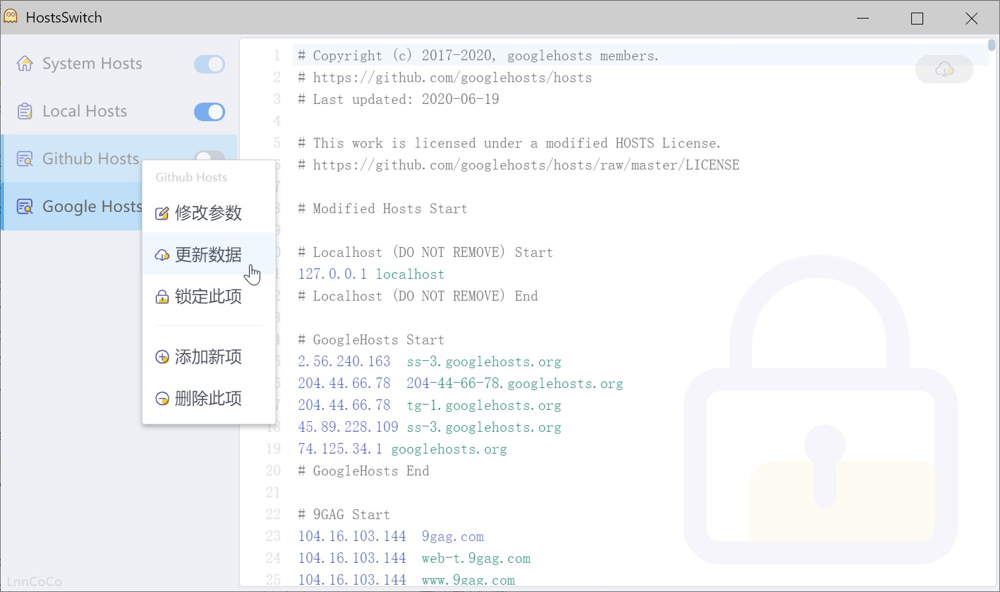

# HostsSwitch

## 介绍

这是一个为了练手做的小工具。看见`aardio`官方有一个修改版的[`hostsSwitchHelper`](https://github.com/aardio/hostsSwitchHelper)，于是学习了一下实现。  
自己重头设计实现了界面和逻辑，逻辑都在前端，只有涉及保存文件之类放到`aardio`里。  
前端使用`LuLu UI`+`LESS`+`TypeScript`实现。

功能与`SwitchHosts!`类似，就是方便修改系统 Hosts 信息的小工具。与之不同的是，每个项都是一份独立的 Host 信息，可以自己手动输入，也可以设置`url`参数，方便网络`Hosts`更新（默认会走系统代理设置）。侧边`Switch开关`开启时会自动将所有开启的数据合并，然后存入系统的`Hosts`文件中。

### 目录

`dist`：存放一份编译后的`exe`应用程序  
`lib`：`aardio`的用户库文件存放目录  
`web`：前端编译后的文件，`aardio`打包使用的文件  
`web_source`：前端项目源码。使用`parcel`工具

### 修改生成

- 在`web_source`目录中执行 `npm i` 安装依赖
- 安装完成后，执行 `npm run dev` 启动项目，然后在`aardio`中同时启动，此时`aardio`的页面会访问本地的前端项目，可以实时修改查看（不知道是`aardio`不兼容`parcel`还是本来就是如此，在浏览器直接访问`aardio`的依赖会报错导致无法正常显示程序）。要确保 `6060` 端口未被占用，否则需要修改响应代码
- 修改完成后使用 `npm run build` 编译，程序会自动生成到父级的`web`目录下
